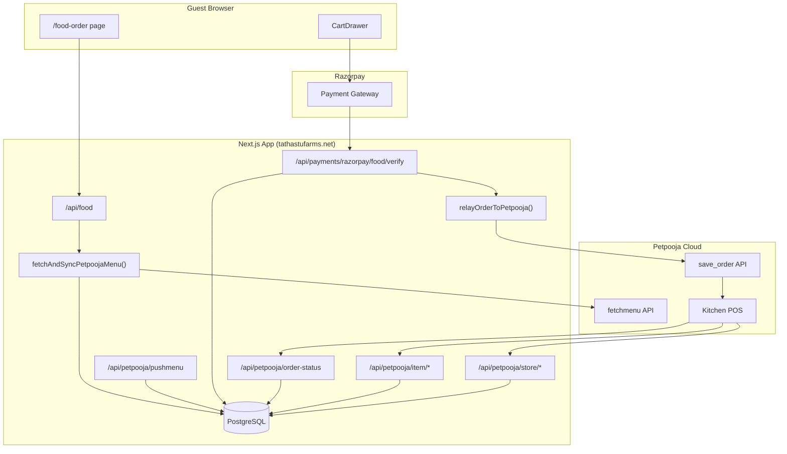

# Petpooja Integration Analysis — Tathastu Farm

> Source: [rounak125/tathastu-farm](https://github.com/rounak125/tathastu-farm) (read via GitHub MCP, no clone)  
> Production site: `https://tathastufarms.net`  
> Analysis date: 2026-07-08

---

## 1. Overview

Tathastu Farm integrates **Petpooja Online Ordering API v2.10** as the POS backend for in-room food ordering. The integration is bidirectional:

| Direction | Purpose |
|-----------|---------|
| **Outbound** | Push paid food orders to Petpooja `save_order` after Razorpay verification |
| **Inbound** | Receive menu pushes, item stock changes, store open/close, and order status callbacks |

Petpooja is **not** the source of truth for payments — Razorpay is. Petpooja receives kitchen orders after payment succeeds. The local Postgres `food_items` table mirrors the Petpooja menu for fast UI rendering.

---

## 2. Architecture



---

## 3. Environment Variables

All Petpooja config lives in server-side env vars. Required for order relay:

| Variable | Required | Default | Purpose |
|----------|----------|---------|---------|
| `PETPOOJA_APP_KEY` | Yes | — | API credentials (header: `app-key`) |
| `PETPOOJA_APP_SECRET` | Yes | — | API credentials (header: `app-secret`) |
| `PETPOOJA_ACCESS_TOKEN` | Yes | — | API credentials (header: `access-token`) |
| `PETPOOJA_REST_ID` | Yes | — | Restaurant ID in Petpooja |
| `PETPOOJA_CALLBACK_URL` | Yes | — | Order status callback URL embedded in `save_order` payload |
| `PETPOOJA_SAVE_ORDER_URL` | No | `https://pponlineordercb.petpooja.com/save_order` | Outbound order endpoint |
| `PETPOOJA_ORDER_TYPE` | No | `D` | `H` = Home delivery, `P` = Pickup, `D` = Dine-in |
| `PETPOOJA_PAYMENT_TYPE` | No | `ONLINE` | Sent as `COD`, `CARD`, or `ONLINE` |
| `PETPOOJA_ENABLE_DELIVERY` | No | `1` | `0` or `1` in order payload |

Tax configuration (optional overrides):

| Variable | Default |
|----------|---------|
| `PETPOOJA_CGST_ID` | `CGST` |
| `PETPOOJA_SGST_ID` | `SGST` |
| `PETPOOJA_CGST_NAME` | `CGST` |
| `PETPOOJA_SGST_NAME` | `SGST` |

Menu fetch (pull sync):

| Variable | Default | Purpose |
|----------|---------|---------|
| `PETPOOJA_FETCH_MENU_URL` | AWS API Gateway URL (see below) | Menu pull endpoint |
| `PETPOOJA_FETCH_MENU_TIMEOUT_MS` | `15000` | Request timeout |
| `PETPOOJA_FETCH_MENU_ON_FOOD_API` | `true` | Auto-sync menu when food page loads |
| `PETPOOJA_FETCH_MENU_SYNC_TIMEOUT_MS` | `12000` | Max wait before serving DB snapshot |

Callback auth for **outbound menu fetch** (not inbound verification):

| Variable | Purpose |
|----------|---------|
| `PETPOOJA_CALLBACK_AUTH_BEARER` | Bearer token for alternate fetch auth |
| `PETPOOJA_CALLBACK_HEADER_NAME` | Custom header name |
| `PETPOOJA_CALLBACK_HEADER_VALUE` | Custom header value |

Default fetch menu endpoint (hardcoded fallback):

```
https://qle1yy2ydc.execute-api.ap-southeast-1.amazonaws.com/V1/mapped_restaurant_menus
```

---

## 4. Database Schema (Petpooja-related)

Defined in `src/db/schema.ts`:

### `food_items`

Stores menu mirrored from Petpooja. Key Petpooja mapping columns:

```typescript
petpoojaItemId: text       // Petpooja item ID (required for order relay)
petpoojaVariantId: text     // Variation ID for items with sizes/options
petpoojaAddonId: text       // Addon ID when applicable
name, category, price, isVeg, taxInclusive, isAvailable
adminAvailabilityOverride  // Admin can lock availability regardless of Petpooja
adminSuppressed            // Admin can hide items from sync updates
```

### `food_orders` (exported as `userFoodOrders`)

Tracks guest food orders and POS sync state:

```typescript
posOrderId: text            // Format: TF-FOOD-{id}
posSyncStatus: text         // 'pending' | 'synced' | 'failed'
posSyncMessage: text
posOrderStatus: text
status: text                // PLACED, PREPARING, DELIVERED, etc.
```

### `petpooja_store_state`

Single-row table for store open/closed:

```typescript
storeOpen: boolean
lastPayload: text           // Raw last webhook payload
```

### `food_menu_settings`

Admin-controlled hidden categories (sync respects these on insert).

---

## 5. Outbound: Order Relay (`save_order`)

**File:** `src/lib/petpooja/server.ts`

### Trigger point

Production path: `POST /api/payments/razorpay/food/verify`

After Razorpay signature verification and payment capture:
1. Insert row into `food_orders`
2. Build external reference: `TF-FOOD-{localId}`
3. Call `relayOrderToPetpooja()`
4. Update `posSyncStatus`, `posSyncMessage`, `errorMessage`

### Item ID mapping

Cart items use **local DB IDs**. Before relay, `mapLineItemsToPetpoojaIds()` resolves:

1. By local numeric ID → lookup `food_items.petpoojaItemId`
2. Fallback: match by item name (case-insensitive)
3. If unmapped → relay fails with HTTP 422

This is critical: every orderable item must have a `petpoojaItemId` populated via menu sync.

### Payload structure

Follows Petpooja `save_order` spec (see `Docs/Review payload.txt`):

```json
{
  "app_key": "...",
  "app_secret": "...",
  "access_token": "...",
  "orderinfo": {
    "OrderInfo": {
      "Restaurant": { "details": { "restID", "res_name", "address", "contact_information" } },
      "Customer": { "details": { "name", "phone", "email", "address" } },
      "Order": { "details": { "orderID", "order_type", "payment_type", "total", "callback_url", ... } },
      "OrderItem": { "details": [ { "id", "name", "price", "quantity", "item_tax", "variation_id", "AddonItem" } ] },
      "Tax": { "details": [ CGST/SGST breakdown ] }
    }
  }
}
```

Tathastu-specific choices:
- Restaurant name: `"Tathastu Farms"`
- Customer address includes room number: `"Address: Tathastu Farm\nRoom No.: {room}"`
- Default customer name: `"In-house Guest"`
- Order description: `"In-room dining order"`
- CGST/SGST split 50/50 from computed tax total
- Tax only applied to non-`taxInclusive` items

### Response validation

On success, validates Petpooja response contains:
- Matching `restID`
- Matching `clientOrderID` (= `TF-FOOD-{id}`)
- Empty `orderID` (accepted save_order convention)

Also retries with `/V1/` path if `/v1/` returns 403 (case-sensitivity workaround).

---

## 6. Inbound: Webhook Endpoints

All routes under `/api/petpooja/`. Petpooja dashboard must register these URLs.

### Callback URL mapping (Petpooja → Tathastu)

| Petpooja API spec endpoint | Tathastu route | Method |
|----------------------------|----------------|--------|
| Push Menu | `/api/petpooja/pushmenu` | POST |
| Push Menu (alt) | `/api/petpooja/pushmenu_endpoint` | POST |
| Fetch Menu (mirror) | `/api/petpooja/menufetch` | POST |
| Update Item In Stock | `/api/petpooja/item/on`, `/item_on`, `/item_stock` | POST |
| Update Item Out of Stock | `/api/petpooja/item/off`, `/item_off`, `/item_stock_off` | POST |
| Get Store Status | `/api/petpooja/get_store_status`, `/store/status` | GET/POST |
| Update Store Status | `/api/petpooja/update_store_status`, `/store/update-status` | POST |
| Order Status Callback | `/api/petpooja/order-status` | POST |

Multiple alias routes exist because Petpooja partner configs may use different path conventions (`item-on` vs `item_on`).

### Push Menu (`/api/petpooja/pushmenu`)

**Handler:** `src/app/api/petpooja/handlers.ts → handlePushmenu()`

1. Accept JSON payload from Petpooja
2. Respond immediately: `{ success: "1", message: "Menu items are successfully listed." }`
3. Background sync via Next.js `after()` → `syncPetpoojaMenuPayload()`

Fast response avoids Petpooja callback timeout.

### Menu sync logic (`src/lib/petpooja/menu-sync.ts`)

For each parsed item:
1. Match by `petpoojaItemId` → update existing row
2. Else match by name → attach `petpoojaItemId` to existing row
3. Else insert new row (hidden if category is admin-blocked)

Respects admin overrides:
- `adminSuppressed` items skip all updates
- `adminAvailabilityOverride` items skip availability changes from Petpooja

### Item stock webhooks

**Handler:** `handleItemAvailability(req, isAvailable)`

Updates `food_items.isAvailable` by:
- `petpoojaItemId` match, or
- Local numeric ID match

Returns Petpooja-expected shape:

```json
{ "code": 200, "status": "success", "message": "Stock status updated successfully" }
```

### Store status

- **Update:** Parses `store_open` / `is_open` / `store_status` → upserts `petpooja_store_state`
- **Get:** Returns current `store_open` boolean

### Order status callback (`/api/petpooja/order-status`)

**File:** `src/app/api/petpooja/order-status/route.ts`

1. Extract order reference from payload (`orderID`, `order_id`, etc.)
2. Parse local ID from `TF-FOOD-{id}` format
3. Map Petpooja status → local status:

| Petpooja status | Local status |
|-----------------|--------------|
| accepted, confirmed, preparing, ready | `Preparing` |
| delivered, completed, served | `Delivered` |
| rejected, cancelled, failed | `Cancelled` |
| (unknown) | `Pending` |

4. Update `food_orders.status`

### Callback authentication

**File:** `src/lib/petpooja/webhook.ts`

```typescript
export function verifyPetpoojaCallbackAuth(_req: Request): CallbackAuthResult {
  // Authentication intentionally disabled for Petpooja callback endpoints.
  return { ok: true };
}
```

Inbound webhooks are currently **unauthenticated**. The E2E test script references `PETPOOJA_AUTH_BEARER` / header env vars, but those are used for **outbound menu fetch** fallbacks, not inbound verification.

---

## 7. Menu Sync Strategies

Tathastu uses **two complementary sync paths**:

### A. Push (Petpooja → App)

Petpooja calls `/api/petpooja/pushmenu` when menu changes in POS.

- Parser: `src/lib/petpooja/inbound.ts → parsePushmenuItems()`
- Handles categories, variations, addons, veg flag (`item_attributeid === '1'`), tax inclusive flag

### B. Pull (App → Petpooja)

Triggered by:
1. **Food page load** — `getFoodMenuForDisplay()` calls `syncPetpoojaMenuOnLoad()` (12s timeout, non-blocking fallback to DB)
2. **Admin manual sync** — `POST /api/admin/food-menu/sync` (admin auth required)

Pull flow (`src/lib/petpooja/fetch-menu.ts`):
1. POST to fetch menu URL with headers: `app-key`, `app-secret`, `access-token`, body `{ restID }`
2. On auth failure → retry with callback bearer/header auth (GET or POST)
3. On 403 with custom URL → fallback to default AWS gateway URL
4. Parse response → `syncPetpoojaMenuPayload()`

---

## 8. End-to-End Order Flow

```
Guest selects items on /food-order
        ↓
Menu loaded from DB (with optional Petpooja pull sync)
        ↓
Guest pays via Razorpay checkout
        ↓
POST /api/payments/razorpay/food/verify
  ├── Verify HMAC signature
  ├── Verify payment captured + amount match
  ├── Insert food_orders row
  ├── relayOrderToPetpooja() → Petpooja save_order
  ├── Update posSyncStatus (synced | failed)
  └── Telegram notification
        ↓
Kitchen receives order on Petpooja POS
        ↓
Petpooja POST /api/petpooja/order-status
  └── Updates food_orders.status (Preparing → Delivered)
        ↓
Guest sees status in /dashboard via /api/me/food-orders
```

Direct order creation (`POST /api/food-orders`) is **disabled in production** unless `ALLOW_DIRECT_FOOD_ORDER_CREATE=1`.

---

## 9. Petpooja Dashboard Configuration

When setting up the integration in Petpooja partner panel, register these callback URLs (production example):

| Callback type | URL |
|---------------|-----|
| Push Menu | `https://tathastufarms.net/api/petpooja/pushmenu` |
| Item In Stock | `https://tathastufarms.net/api/petpooja/item/on` |
| Item Out of Stock | `https://tathastufarms.net/api/petpooja/item/off` |
| Get Store Status | `https://tathastufarms.net/api/petpooja/store/status` |
| Update Store Status | `https://tathastufarms.net/api/petpooja/store/update-status` |
| Order Status | `https://tathastufarms.net/api/petpooja/order-status` |

Set `PETPOOJA_CALLBACK_URL` to the order status URL — it is embedded in every `save_order` payload.

Credentials (`APP_KEY`, `APP_SECRET`, `ACCESS_TOKEN`, `REST_ID`) come from Petpooja and go into server env.

---

## 10. Code Organization

```
src/lib/petpooja/
├── server.ts          # save_order payload builder + relayOrderToPetpooja()
├── fetch-menu.ts      # Pull menu from Petpooja API
├── menu-sync.ts       # Upsert parsed items into food_items
├── inbound.ts         # Parse pushmenu / stock / store payloads
└── webhook.ts         # Order reference parsing + status mapping

src/app/api/petpooja/
├── handlers.ts        # Shared handlers (pushmenu, stock, menufetch)
├── pushmenu/route.ts
├── order-status/route.ts
├── item/on|off/route.ts
├── store/status|update-status/route.ts
└── (alias routes for underscore/hyphen variants)

src/lib/food/
├── menu-server.ts     # getFoodMenuForDisplay() with sync-on-load
├── sync-on-load.ts    # Non-blocking menu pull before page render
└── menu-settings.ts   # Admin hidden categories

Docs/
├── API Guide for Placing Orders on Petpooja POS.pdf
├── Petpooja Sandbox Guide for Integration Testing.pdf
├── Review payload.txt                    # Sample save_order JSON
└── petpooja-apiary-v210/                 # Full API Blueprint v2.10 extract
```

---

## 11. Testing & Validation

### Live E2E script

`scripts/petpooja-live-full-e2e.sh` — full production integration test:

```bash
BASE_URL="https://tathastufarms.net" \
APP_AUTH_HEADER="Authorization: Bearer <token>" \
PETPOOJA_AUTH_BEARER="Bearer <callback-bearer>" \
PETPOOJA_HEADER_NAME="<header-name>" \
PETPOOJA_HEADER_VALUE="<header-value>" \
./scripts/petpooja-live-full-e2e.sh
```

Tests: order create → Petpooja relay → status callback matrix → pushmenu/stock/store endpoints.

### Food payment verify harness

`scripts/food-payment-verify-harness.sh` — validates real Razorpay tuple → DB persist → Petpooja relay.

---

## 12. Key Design Decisions

1. **Local menu cache** — Petpooja menu synced to Postgres; UI never calls Petpooja directly
2. **ID mapping layer** — Cart uses local IDs; relay translates to `petpoojaItemId` before save_order
3. **Payment-first** — Orders only relay after Razorpay verification (no unpaid POS orders)
4. **Async pushmenu** — Immediate 200 response + background sync prevents Petpooja timeout
5. **Graceful menu fallback** — If pull sync fails/times out, serve last-known DB snapshot
6. **Order reference convention** — `TF-FOOD-{id}` links Petpooja callbacks to local rows
7. **Admin overrides** — Staff can suppress items or lock availability independent of Petpooja
8. **Alias webhook routes** — Duplicate endpoints for Petpooja path naming variants
9. **Tax split logic** — CGST/SGST computed per-line for non-inclusive items only

---

## 13. Gaps & Notes for Replication

| Item | Status |
|------|--------|
| Inbound webhook auth | Disabled (`verifyPetpoojaCallbackAuth` always passes) |
| Petpooja credentials in repo | Not committed (env-only) |
| Sandbox vs production URLs | Separate configs expected per environment |
| Item addon support in relay | Partial — sends first addon ID if mapped |
| Retry on failed relay | No automatic retry queue (unlike CheckinCloud reconciliation) |

---

## 14. Reference Documentation in Repo

The tathastu-farm repo includes offline copies of Petpooja official docs:

- `Docs/petpooja-apiary-v210/api-description-document` — Full API Blueprint (v2.10)
- `Docs/API Guide for Placing Orders on Petpooja POS.pdf`
- `Docs/Petpooja Sandbox Guide for Integration Testing.pdf`
- `Docs/Review payload.txt` — Annotated save_order example

Canonical online spec: https://onlineorderingapisv210.docs.apiary.io/
